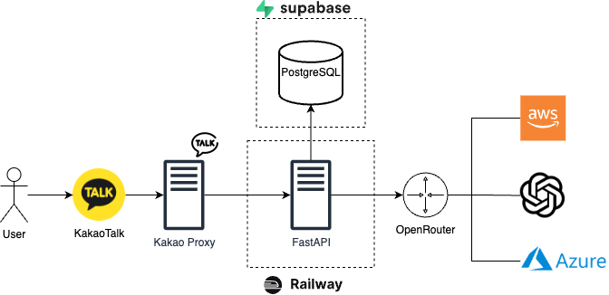

## 소개

Waria는 FastAPI 기반의 백엔드 프로젝트로, 주식 투자 관련 질문에 대해 AI가 기술적/펀더멘탈 분석을 수행하고 답변하는 카카오톡 챗봇 서비스를 제공합니다. 이 시스템은 실시간 금융 데이터를 수집한 뒤 대화형 LLM(대형 언어 모델)을 활용하여 사용자의 질문에 대한 간결하고 확신있는 투자 분석 답변을 생성합니다. 이를 통해 개별 투자자들이 복잡한 차트나 재무 지표를 직접 해석하지 않고도 손쉽게 요약된 인사이트를 얻을 수 있습니다.

## 프로젝트 개요

Waria 프로젝트의 주요 목적은 주식 시장 데이터의 자동 분석과 요약입니다. 사용자는 카카오톡 챗봇을 통해 간단한 질문만으로도 관심 종목의 현재 상태나 전망에 대한 분석을 얻을 수 있습니다. 백엔드는 Yahoo Finance와 Finnhub 등으로부터 실시간 주가 데이터, 지표, 뉴스 등을 가져와, 이를 기반으로 기술적 패턴 분석 또는 재무 지표 분석을 수행합니다. 그런 다음 OpenAI GPT-4와 같은 대형 언어 모델을 이용해 해당 데이터를 해석한 인간 전문가 수준의 답변을 생성합니다. 이 모든 과정이 FastAPI 서버 상에서 이루어져, 카카오 i 오픈빌더의 스킬서버로 연동되어 동작합니다.

이 프로젝트가 해결하는 문제는 방대한 투자 정보의 접근성과 해석입니다. 일반 투자자들은 실시간으로 변하는 차트와 재무제표, 뉴스를 모두 추적하기 어렵고, 이를 종합적으로 해석하는 데에도 어려움이 있습니다. Waria는 이러한 정보를 자동으로 수집하고 AI를 통해 이해하기 쉽게 요약함으로써, 사용자가 짧은 질문만으로 핵심 투자 인사이트를 얻도록 도와줍니다.

## 주요 기능 및 특징

- **카카오톡 챗봇 연동**: 카카오 i 오픈빌더를 통해 챗봇으로 동작하며, 정해진 엔드포인트(`/analyze/request`, `/analyze/result`)로 카카오 플랫폼의 요청을 받아 응답합니다. 사용자가 챗봇에 질문하면 백엔드가 데이터를 처리하고 카카오톡에 맞는 형식으로 결과를 반환합니다.
- **FastAPI 기반 비동기 서버**: Python FastAPI 프레임워크로 구현되어 있어 경량하고 빠른 응답이 가능합니다. `BackgroundTasks`를 활용하여 비동기 처리를 함으로써, 사용자 질문을 받은 즉시 응답 대기 카드를 보내고 별도 스레드에서 분석을 수행합니다. 기본 경로(`/`)로 접속하면 간단한 헬스 체크 메시지를 확인할 수 있습니다.
- **실시간 데이터 수집**: Yahoo Finance (yfinance 라이브러리)와 Finnhub API를 이용하여 종목의 최신 데이터를 가져옵니다.
  - 기술적 데이터: 일별 OHLCV(시가, 고가, 저가, 종가, 거래량) 및 보조지표(5/20/60일 이동평균, RSI14, MACD 및 시그널, 볼린저 밴드 상하단)를 계산합니다.
  - 펀더멘탈 데이터: 주요 재무 지표(전년/전분기 대비 PER, PBR, ROE, EPS, 배당수익률 등)와 최근 뉴스 및 애널리스트 동향(실적 서프라이즈, 투자의견 추이, 실적 캘린더)을 수집합니다.
        
  이러한 데이터는 내부적으로 일정 시간(6시간 캐시) 동안 캐싱되어 동일 종목에 대한 반복 요청 시 API 부하를 줄입니다.
        
- **AI 분석 및 응답 생성**: OpenAI의 GPT 계열 모델(예: GPT-4)을 OpenRouter API를 통해 활용합니다. 미리 정의된 시스템 프롬프트와 예시 대화를 사용해 챗봇의 성격과 답변 형식을 조절합니다.
  - 질문의 종류에 따라 기술적 분석이나 펀더멘탈 분석 중 하나에 집중하여 답변하며, 2~3문장 내의 간결한 한국어 해설을 제공합니다.
  - 답변 내용은 사용자가 이해하기 쉽도록 확신형 어조로 작성되며, 모호한 표현이나 감정적인 서사는 배제됩니다 (예: "~일 것 같아요" 대신 "단정적인 결론"을 제시).
  - LLM 함수 호출 기능을 통해 필요한 경우 자동으로  `get_technical_data`나 `get_fundamental_data` 함수를 호출하여 최신 데이터를 조회한 후 분석 결과에 반영합니다. 이를 통해 답변 내용에 구체적인 수치와 지표(예: 돌파 확률 75%, EPS 추정 +6.2% 등)를 포함합니다.
- **대화 내 컨텍스트 활용**: 사용자별 최근 대화 기록을 최대 10개까지 저장하고, 새로운 질문에 대한 응답 생성 시 이전 Q&A를 대화 맥락에 포함시킵니다. 이를 통해 챗봇이 문맥을 이해하고 일관성 있는 답변을 할 수 있습니다. 예를 들어 이전에 특정 종목에 대해 이야기를 나누었다면, 이어지는 질문에서도 그 정보를 활용할 수 있습니다.
- **사용량 제한 및 로그**: 환경 변수로 설정된 일일 요청 제한(`API_LIMIT`)을 두어 과도한 사용을 제한합니다. 사용자의 요청이 일일 한도를 초과하면 안내 메시지를 대신 반환합니다. 모든 대화와 결과 조회 시도는 Supabase에 기록되어, 추후 사용 통계나 로그 분석에 활용할 수 있습니다.
- **데이터 저장 (Supabase)**: Supabase (오픈소스 Firebase 대안)을 데이터베이스로 사용합니다. 각 질문(`Chat`)과 결과 조회(`ChatAccess`) 기록을 Supabase 테이블에 저장하여 지속적인 대화 이력 관리를 합니다. 데이터베이스 연결 정보(`SUPABASE_URL`, `SUPABASE_KEY`)는 환경 변수로 주입되며, Pydantic 모델을 사용해 일관된 스키마로 관리됩니다. (※ 초기 사용 시 Supabase에 `chats` 및 `chat_accesses` 테이블을 생성하고 스키마를 설정해야 합니다.)
- **환경 설정 및 구성**: 별도의 설정 파일 없이 `.env` 환경 변수로 주요 API 키와 설정값을 관리합니다. 예를 들어 OpenAI(OpenRouter) API 키, Finnhub API 키, 사용 모델명 등을 손쉽게 바꿀 수 있어 구성 유연성이 높습니다.

## 설치 방법

시스템을 로컬에서 실행하거나 서버에 배포하기 위한 설치 방법은 다음과 같습니다:

1. **코드 받기**: GitHub 레포지토리를 클론합니다.
    
    ```bash
    git clone https://github.com/gatofsung/waria.git
    cd waria
    ```
    
2. **Python 환경 설정**: Python 3.9+ 버전이 설치되어 있어야 합니다. 가상환경을 사용하는 것을 권장합니다. 필요한 경우 가상환경을 만든 후 활성화하세요.
    
    ```bash
    python3 -m venv venv
    source venv/bin/activate
    ```
    
3. **의존성 설치**: 레포지토리 루트 디렉토리에 있는 `requirements.txt` 파일을 통해 필요한 파이썬 패키지를 설치합니다.
    
    ```bash
    pip install -r requirements.txt
    ```
    
    주요 의존성에는 FastAPI, Hypercorn(ASGI 서버), python-dotenv, yfinance, finnhub-python, supabase-py, cachetools 등이 포함됩니다.
    
4. **환경 변수 설정**: 서비스 실행에 필요한 API 키 및 설정값을 환경 변수로 설정해야 합니다. 프로젝트 루트에 `.env` 파일을 생성하고 다음 항목들을 채워넣습니다:
    
    ```bash
    # .env 파일 예시
    API_LIMIT=10                            # 1일당 허용 요청 수 (예: 10회)
    SUPABASE_URL=https://xxxxxx.supabase.co # Supabase 프로젝트 URL
    SUPABASE_KEY=YOUR_SUPABASE_API_KEY      # Supabase API 키 (Service role 권장)
    OPEN_ROUTER_URL=https://openrouter.ai/api/v1/chat/completions   # OpenRouter 엔드포인트 URL
    OPENROUTER_API_KEY=YOUR_OPENROUTER_KEY  # OpenRouter에서 발급받은 API 키
    LLM_MODEL=openai/gpt-4-0613             # 사용할 LLM 모델 (예: GPT-4 함수호출 지원 버전)
    FINNHUB_API_KEY=YOUR_FINNHUB_API_KEY    # Finnhub API 키
    ```
    
    위 값들 중 Supabase와 Finnhub는 해당 서비스 웹사이트에서 계정 생성 후 API 키를 발급받아야 합니다. OpenRouter 또한 OpenAI 또는 다른 LLM을 프록시하는 서비스로, OpenRouter 웹사이트에 가입하여 API 키를 받아 사용하거나, 직접 OpenAI API를 쓸 경우 코드 변경이 필요합니다.
    
    (※ 개발/테스트 용도로 Supabase를 바로 사용하기 어렵다면, `app/repository` 부분을 수정하여 임시로 메모리에 저장하도록 변경할 수도 있습니다.)
    
5. **서버 실행**: 환경 변수를 설정한 후, FastAPI 서버를 실행합니다. 기본적으로 Hypercorn 서버를 사용하도록 되어 있으나 Uvicorn도 사용 가능합니다. 예를 들어 Hypercorn으로 실행하려면:
    
    ```bash
    hypercorn app.main:app --reload
    ```
    
    또는 Uvicorn을 사용할 경우:
    
    ```bash
    uvicorn app.main:app --reload
    ```
    
    정상적으로 실행되면 로컬에서 `http://localhost:8000`으로 서버에 접속할 수 있습니다. 브라우저에서 해당 주소로 접속하면 `{"message": "Hello World"}` JSON 응답이 나오는 것을 확인하세요.
    
6. **카카오톡 챗봇 연동**: 카카오 i 오픈빌더에서 스킬 서버로 위 실행한 엔드포인트를 등록해야 합니다. 오픈빌더 시나리오에서 스킬 호출 블록의 URL을 `http://<서버주소>/analyze/request`로, 이후 스킬 응답 대기 후 결과를 받는 블록을 `http://<서버주소>/analyze/result`로 설정합니다. (자세한 연동 방법은 카카오 개발자 문서를 참고하세요.)
    
    로컬에서 테스트하는 경우 ngrok과 같은 도구로 터널링하여 카카오 서버가 접근할 수 있는 도메인을 만들어주어야 합니다.
    

## 사용 예제

Waria 챗봇은 사용자의 자연어 질문을 입력으로 받아, 해당 종목에 대한 간략한 투자 분석을 답변합니다. 몇 가지 예시를 통해 동작을 살펴보겠습니다:

- **기술적 분석 질문**: 사용자가 "엔비디아 지금 들어가도 돼?"라고 질문하면, 백엔드는 엔비디아의 최신 주가 데이터와 차트 지표를 수집하여 LLM으로 하여금  Bulkowski 패턴과 돌파 확률을 분석하도록 합니다. 그 결과 챗봇은 다음과 같은 답변을 제공합니다.
    - **챗봇 응답:** "고점이 일자로 정리되고, 저점이 계속 올라오는 전형적인 상승 삼각형. $940 저항 구간에 근접했고, 이 패턴은 보통 돌파 성공 확률이 75% 이상이야."
- **펀더멘탈 분석 질문**: 사용자가 "테슬라 실적 기대돼?"라고 물으면, 백엔드는 지난 7일간의 테슬라 EPS 추정치 변화율, 최근 주가 변동 및 관련 뉴스를 종합하여 분석합니다. LLM은 이를 바탕으로 실적에 대한 시장의 기대감을 평가하여 답변합니다.
    - **챗봇 응답:** "EPS 추정이 최근 일주일 간 +6.2% 상승했고, 오늘 주가는 +2.1% 올랐어. 자율주행 택시 출시 계획 등 긍정적인 뉴스도 있어. 기대도 반응도 살아 있는 구간이야. 눌림 조정 시 진입을 고려해봐."

위 예시들처럼, 질문에 따라 챗봇은 기술적 분석 또는 펀더멘탈 분석 중 하나를 선택하여 관련 있는 정보만 응답합니다. 답변은 항상 구체적인 수치와 함께 투자 행동에 대한 제안(진입 또는 관망 등)을 담고 있어, 사용자가 바로 참고할 수 있도록 되어 있습니다. 또한 한 번의 질문-응답 이후 사용자가 추가 질문을 하면 이전 대화를 반영하여 일관성 있는 답변을 이어갈 수 있습니다.

> 참고: 개발 환경에서 직접 API를 호출해볼 수도 있습니다. 예를 들어, 터미널에서 curl을 사용해 /analyze/request 엔드포인트에 Kakao 요청과 유사한 JSON payload를 POST하면, 응답으로 Kakao 톡에서 표시될 카드(JSON 구조)를 받을 수 있습니다. 이후 /analyze/result에 해당 chat_id를 보내어 최종 결과 메시지를 받을 수도 있습니다.
> 

## 아키텍처 & 기술 스택



## 프로젝트 구조

프로젝트의 주요 폴더와 파일 구조는 다음과 같으며, 각 구성 요소의 역할은 아래에 설명되어 있습니다:

```
waria/
├── app/                        # 애플리케이션 소스 코드 패키지
│   ├── main.py                 # FastAPI 엔드포인트 정의 (챗봇 요청/응답 처리)
│   ├── config.py               # 환경 변수 로딩 (API 키 및 설정값)
│   ├── container.py            # 의존성 주입 컨테이너 (ChatBot, Fetcher, 레포지토리 초기화)
│   ├── llm/                    # LLM(대형 언어 모델) 관련 모듈
│   │   ├── chat_bot.py         # ChatBot 클래스 (OpenAI API 통해 답변 생성 로직)
│   │   └── templates.py        # LLM 프롬프트 템플릿과 예시 (시스템 메시지, 예시 질문/답변)
│   ├── finance/                # 금융 데이터 수집 및 처리 모듈
│   │   ├── fetcher.py          # Fetcher 클래스 (Yahoo & Finnhub에서 데이터 통합 조회)
│   │   ├── interface.py        # 데이터 클래스 정의 (TechnicalData, FundamentalData 구조)
│   │   └── fetchers/           # 개별 데이터 소스별 펫처
│   │       ├── yahoo_finance.py    # Yahoo Finance 데이터 수집 (주가, 뉴스, 지표 계산)
│   │       └── finnhub.py          # Finnhub 데이터 수집 (실적 서프라이즈, 애널리스트 추이 등)
│   ├── repository/             # 데이터베이스 연동 모듈 (Supabase를 통한 저장소)
│   │   ├── models.py           # Pydantic 모델 (Chat, ChatAccess 구조 정의)
│   │   ├── chat_repository.py  # 채팅 기록 관리 (Supabase chats 테이블 CRUD)
│   │   └── chat_access_repository.py  # 챗봇 이용 기록 관리 (Supabase chat_accesses 테이블)
│   └── util/                   # 유틸리티 모듈
│       ├── logger.py           # 로거 설정 (JSON 포맷 로그 출력)
│       └── response_util.py    # 응답 유틸 (카카오톡 메시지 포맷 생성 등)
├── requirements.txt            # 파이썬 패키지 의존성 목록
├── README.md                   # 프로젝트 소개 및 안내 (본 파일)
└── LICENSE.md                  # 라이선스 정보 (MIT License)

```

각 폴더/파일의 내용은 다음과 같습니다:

- **app/main.py** – FastAPI 애플리케이션의 라우트가 정의된 메인 파일입니다. `/analyze/request` POST 엔드포인트에서 카카오톡의 요청(사용자 발화와 사용자 ID)을 받아 백그라운드 작업으로 `ChatBot.get_analysis`를 호출하고 즉시 응답 대기 카드(JSON)를 반환합니다. `/analyze/result` POST 엔드포인트에서는 분석 완료 여부를 확인하여, 준비된 답변이 있으면 전달하고 아직이면 대기 중임을 알려줍니다. 이 파일에서 백엔드 서비스의 핵심 흐름(요청 → 처리 → 응답)을 확인할 수 있습니다.
- **app/config.py** – `python-dotenv`를 사용해 .env 파일의 내용을 불러오며, API 키나 한도 등의 설정 값을 전역 변수로 제공합니다.
- **app/container.py** – 의존성 주입을 위한 컨테이너 역할을 합니다. Supabase URL과 키를 이용해 `ChatRepository`와 `ChatAccessRepository` 인스턴스를 생성하고, OpenRouter API 정보로 `ChatBot` 인스턴스를, Finnhub API 키로 `Fetcher` 인스턴스를 각각 생성합니다. 이렇게 생성된 객체들은 애플리케이션 전체에서 사용되며, `app.main` 등에서 import하여 활용합니다.
- **app/llm/chat_bot.py** – LLM을 통해 질문에 대한 분석 답변을 생성하는 로직이 구현된 클래스입니다. OpenRouter를 경유하여 OpenAI 모델에 메시지를 보내고, 함수 호출(Function Calling) 기능을 사용해 필요한 경우 `get_technical_data` 또는 `get_fundamental_data` 함수를 호출하도록 합니다. 두 단계로 API 호출을 수행하여 (첫 번째 호출에서 함수 사용 결정 → 함수 실행 후 결과와 함께 두 번째 호출) 최종 답변을 얻습니다. 내부적으로 대화 메시지 목록을 구성할 때 `templates.py`에 정의된 시스템 메시지(캐릭터 성격 및 지침)와 예시 Q&A, 그리고 과거 채팅 기록과 새로운 사용자 질문을 모두 포함시켜 프롬프트로 사용합니다.
- **app/llm/templates.py** – 챗봇의 말투나 답변 형식을 결정하는 여러 프롬프트 템플릿이 정의되어 있습니다. 챗봇 캐릭터 설정(예: 20대 후반 여성 투자 분석가 LIA의 성격), 기술적 분석 시 따라야 할 체크리스트(Bulkowski 패턴 분석 등), 펀더멘탈 분석 시 따라야 할 지침(EPS 추이, 주가 반응, 뉴스 요약 등)이 포함된 시스템 메시지가 작성되어 있습니다. 또한 LLM에게 학습시킬 예시 질문-답변 쌍(few-shot examples)도 여기에 정의되어 있어, 모델이 어떤 식으로 답변해야 하는지 참고하도록 합니다.
- **app/finance/fetcher.py** – YahooFinanceFetcher와 FinnhubFetcher를 사용하여 종목의 기술적/펀더멘탈 데이터를 한번에 얻는 `Fetcher` 클래스가 있습니다. 두 종류의 데이터를 반환하는 `get_technical_data(symbol)`와 `get_fundamental_data(symbol)` 메서드를 제공합니다. 각 메서드는 캐시 데코레이터(`@cached`)가 적용되어 있어 동일 종목에 대해 6시간 내 반복 호출 시 캐시된 결과를 반환, 외부 API 호출을 줄입니다.
- **app/finance/fetchers/yahoo_finance.py** – 제3자 라이브러리인 *yfinance*를 활용하여 Yahoo 파이낸스 데이터를 가져옵니다. `get_quote()`는 현재가, 변동률, 시가총액, 52주 고저가 등을 반환하고, `get_news()`는 최신 뉴스를 제목/요약 형태로 리스트업합니다. 또한 `get_ohlcv_and_indicators()` 메서드는 최근 3개월 주가 데이터를 불러와 OHLCV와 핵심 기술적 지표(이동평균, RSI, MACD, 볼린저 밴드)를 계산하여 딕셔너리 형태로 제공합니다. `get_fundamental_metrics()`는 Yahoo의 종목 정보에서 P/E, P/B, ROE, EPS 등 기본 재무 지표를 추출하고, EPS 전망 변화율 등 추가 정보를 합쳐서 반환합니다.
- **app/finance/fetchers/finnhub.py** – 공식 Finnhub Python SDK를 사용하여, 해당 종목의 실적 서프라이즈 기록, 애널리스트 추천 추이, 실적 발표 일정 등을 조회합니다. `get_fundamental_metrics()` 메서드는 위 세 가지 정보를 한꺼번에 딕셔너리에 담아 반환하며, Yahoo에서 얻은 재무 지표들과 함께 최종 펀더멘탈 데이터에 사용됩니다. Finnhub API 키가 필요하며, 무료 플랜의 경우 제공되는 데이터에 제한이 있을 수 있습니다.
- **app/repository/models.py** – 애플리케이션에서 사용하는 데이터 모델을 정의합니다. Pydantic의 BaseModel을 상속한 `Chat`과 `ChatAccess` 클래스로, 각각 사용자의 한 번 질문-응답 데이터와 사용자의 결과 조회 기록을 표현합니다. `Chat`에는 사용자 ID, 질문(utterance), 답변(response), 생성시간(created_at)이 있고, `ChatAccess`에는 어떤 대화(chat_id)에 누가 접근했고(chat_status: SUCCESS/WAITING/FAILURE) 등이 기록됩니다.
- **app/repository/chat_repository.py** – Supabase의 `chats` 테이블과 연동되는 클래스입니다. `get_chats(user_id)`로 특정 사용자의 과거 채팅기록 목록을 불러오고, `get_chat(chat_id)`로 특정 채팅 단건을 조회합니다. `save_chat(Chat)`은 새 채팅 레코드를 DB에 저장하고 생성된 ID 등을 반환하며, `update_chat_response(chat_id, response)`는 백그라운드 작업 완료 후 답변을 해당 레코드에 업데이트합니다. (Supabase의 create_client를 통해 테이블에 직접 쿼리합니다.)
- **app/repository/chat_access_repository.py** – Supabase `chat_accesses` 테이블과 연동되는 클래스입니다. 주로 `save_chat_access(ChatAccess)` 메서드를 통해 사용자가 결과를 조회할 때마다 접근 기록을 남깁니다. (예: WAITING 단계에서 조회했는지, SUCCESS 시 응답을 받았는지 등의 상태를 저장하여 사용 패턴을 분석할 수 있습니다.)
- **app/util/logger.py** – Python 로깅 설정을 도와주는 유틸입니다. JSON 포맷으로 로그를 출력하도록 `JsonFormatter`를 정의하고, `setup_logging()`으로 전역 로거를 설정합니다. 이를 통해 콘솔 로그를 수집할 때 구조화된 JSON 형태로 로그가 남아 디버깅 및 모니터링에 유용합니다.
- **app/util/response_util.py** – FastAPI 엔드포인트에서 반환할 응답을 생성하는 도움 함수들이 있습니다. `kakao_response(text)`는 카카오톡 간단 텍스트 응답 형식에 맞춰 JSON을 생성하고, `kakao_textcard_response(title, description, chat_id)`는 텍스트 카드 형식의 응답(JSON)을 생성합니다. 이 텍스트 카드에는 "결과 받기" 버튼이 포함되어 있으며, 사용자가 누르면 `chat_id`가 포함된 추가 요청을 보내도록 설계되어 있습니다. 이러한 응답 형식은 모두 카카오 i 오픈빌더의 요구사항을 따릅니다.